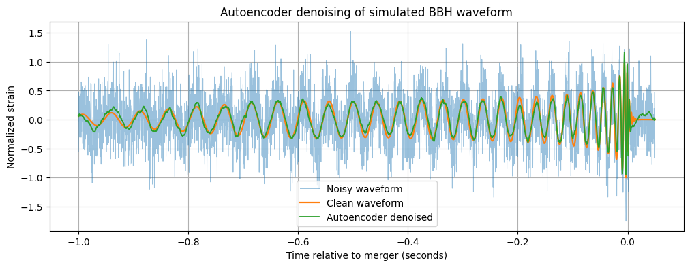

black-hole-merger-denoising
# Machine Learning-Based Denoising of Binary Black-Hole Merger Waveforms
- Divyanshu Beniwal

This is an independent research-oriented machine learning project focused on binary black-hole merger waveform denoising.

## What this project includes

- Visualization of real GW150914 LIGO strain data using GWOSC/GWpy
- Time-frequency Q-transform visualization of the GW150914 chirp
- Simulation of GW150914-like binary black-hole merger waveforms using PyCBC
- Gaussian noise injection at multiple noise levels
- Classical denoising baselines:
  - Moving average
  - Savitzky-Golay filter
  - Butterworth low-pass filter
- Conv1D autoencoder-based waveform denoising
- Evaluation using MSE, MAE, Pearson correlation, and SNR

## Current status

This is an early-stage research prototype. The current version uses simulated BBH waveforms and controlled Gaussian noise. Future work will include mass-generalization, realistic LIGO noise injection, and physics-preservation analysis.

## Tools used

Python, GWpy, GWOSC, PyCBC, NumPy, SciPy, Pandas, Matplotlib, TensorFlow/Keras.
